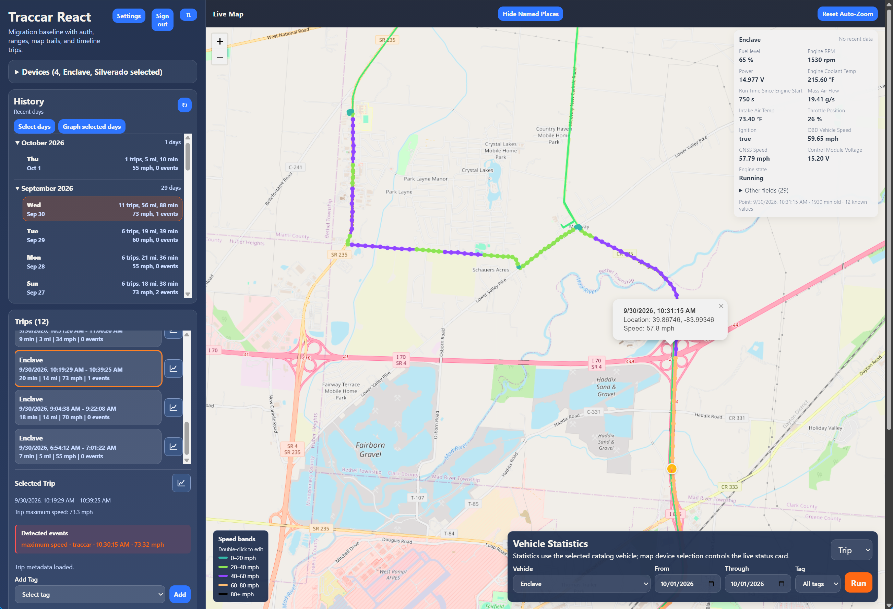
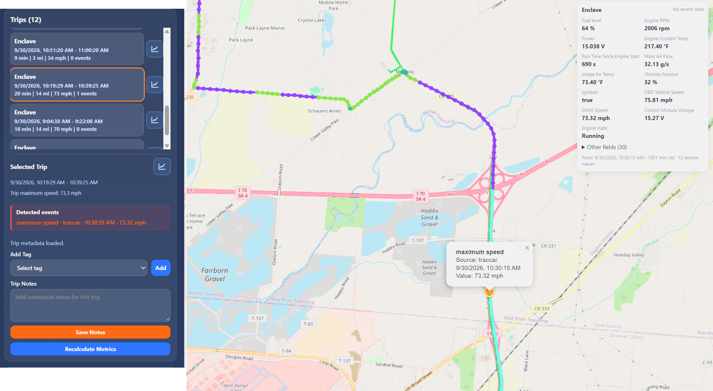
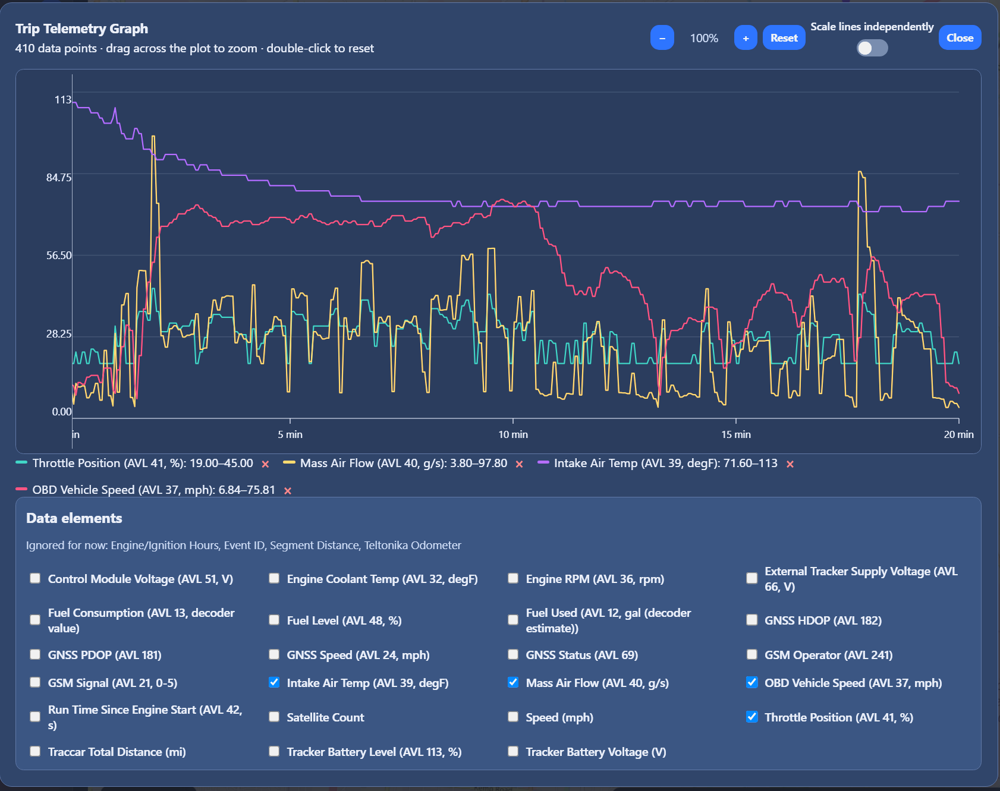

# Traccar React Migration

Modern React + Vite frontend with a .NET backend for trip analysis, telemetry, and import workflows.
Includes Bouncie trip-history import and Traccar-focused telemetry tooling for self-hosted vehicle history.

## Who This Is For

- People migrating from Automatic or Bouncie who want long-term control of trip history.
- Traccar users who want richer trip analysis, tagging, and diagnostics workflows.
- Self-hosters who want to own their data and avoid monthly platform lock-in.

## License

This project is licensed under AGPLv3. See:

- `LICENSE`
- `LICENSING.md` (plain-language usage and compliance notes)

## License FAQ

- Commercial use is allowed under AGPLv3.
- If someone modifies AGPL-covered backend code and serves it over a network, they must provide corresponding source to users interacting with that service.
- AGPLv3 alone cannot add extra field-of-use restrictions; that requires a separate licensing model.

## What Is Included

- React app shell with persisted API settings
- Leaflet map rendering with live position markers
- Buttons to test API connectivity and load live snapshot data
- Vite dev proxy for `/api` to avoid browser CORS issues during local development
- Bouncie CSV import into the app database for durable historical trip analysis
- Bouncie OAuth connection support for rate-limited backfill workflows

## Visual Preview

### Main Map View



### Trip Details View



### Telemetry View



For Settings walkthrough screenshots and section-by-section setup guidance, see:

- `docs/SETTINGS_CONFIGURATION_GUIDE.md`

## Code Structure

- `src/App.jsx`: orchestration and state composition
- `src/components/`: UI sections (`RangeControls`, `StatusCard`, `DeviceList`, `DayPanel`, `TripPanel`, `SettingsModal`)
- `src/lib/settings.js`: settings defaults and persistence
- `src/lib/time.js`: range helpers and datetime-local utilities
- `src/lib/geo.js`: distance and position normalization helpers
- `src/lib/trips.js`: trip detection and day summary logic
- `src/lib/traccarApi.js`: session-aware API client

## Run Locally

```bash
cd traccar-react
npm install
npm run dev
```

Default API base in the app is `/api`.

## Proxy Target

By default, dev proxy sends `/api` to:

`http://<traccar-host>:8082`

You can override that target:

```bash
VITE_TRACCAR_TARGET=http://<traccar-host>:8082 npm run dev
```

## Screenshots

Place publishable screenshots in:

- `docs/screenshots/`

Capture conventions and recommended views are documented in:

- `docs/screenshots/README.md`

Settings walkthrough and configuration notes are documented in:

- `docs/SETTINGS_CONFIGURATION_GUIDE.md`

## Operations and Validation

This README is intentionally brief. Deep operational steps and scripts live in dedicated docs:

- `AI_OVERVIEW.md` (architecture and current milestone status)
- `VEHICLE_APP_DOCKER_DEPLOYMENT.md` (deployment guidance)
- `scripts/` (schema migrations, smoke tests, regression runners, health/retention SQL)

Quick checks from repo root:

```powershell
npm test
dotnet run --project tests/TripIdentity.Tests/TripIdentity.Tests.csproj
dotnet run --project tests/TripImport.IntegrationTests/TripImport.IntegrationTests.csproj --artifacts-path .artifacts/import-tests
```

## Public Roadmap

- Stabilize status-card attributes with multi-day data validation.
- Finalize fallback editable vehicle fields policy.
- Run first archive batch once retention window eligibility is reached.
- Tune growth thresholds from observed production trends.
- Expand FMB003 and DTC decoding coverage as real hardware payloads require.
